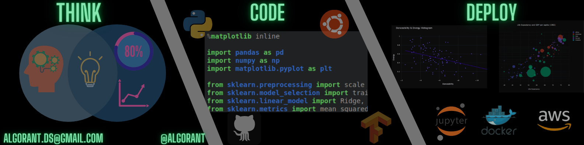

<!--
**Algorant/Algorant** is a ✨ _special_ ✨ repository because its `README.md` (this file) appears on your GitHub profile.
-->

# Hi there 👋
---
 
### My name is Ivan. I recently graduated from the Lambda School Data Science program.

### I'm currently looking for work! Feel free to visit my [LinkedIn](https://www.linkedin.com/in/ivan-s-santos/) or DM me on [Twitter](https://twitter.com/Algorant)   

### I am interested in:
* ### Open source projects,
* ### Making the world better through the lens of Machine Learning,
* ### The intersection between Data Analysis and Dataviz.

### I have a public Roam where I mostly review books with my thoughts.

### I've highlighted some of the tools I use projects I've worked on and am proud of below:

---

<!--OS-->

<!--Languages-->

<!--Tools-->

<!--Libraries-->

<!--Frameworks-->

